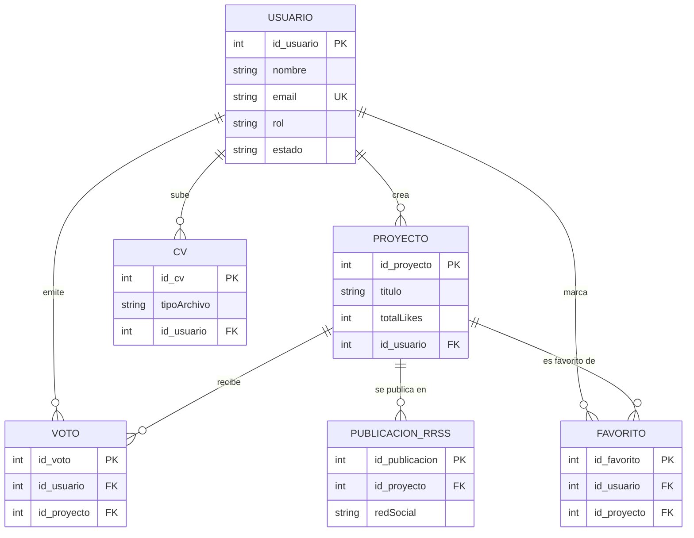
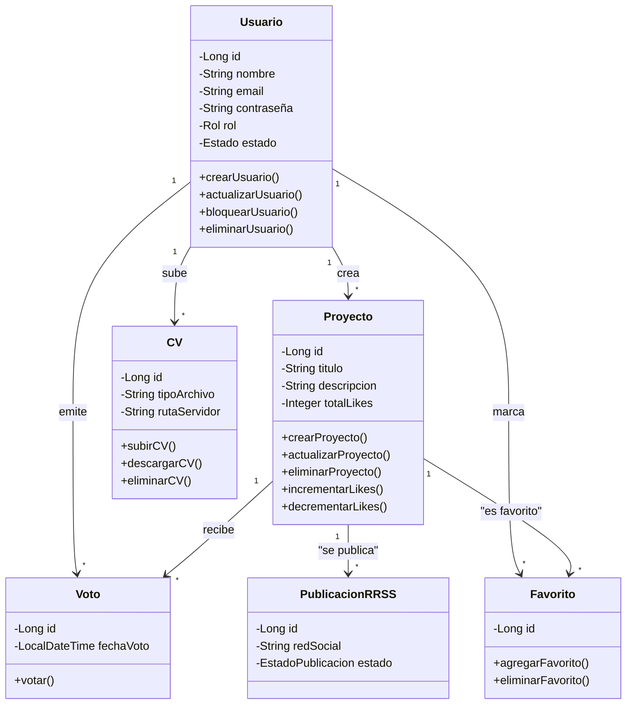

# Hito 3 – Entrega Esquemática

**Proyecto:** Plataforma Social de Portfolios — Carlos Díaz Oller (v2.0)  
**Objetivo:** Consolidar la arquitectura del sistema y documentar la lógica de datos y negocio del MVP.

## 1. Modelo Entidad-Relación (ER)

**Objetivo:** Representar entidades y relaciones de la base de datos de la plataforma.

### Diagrama ER (Mermaid)

### Entidades principales

**Usuario**
- **Atributos:** id_usuario, nombre, email, contraseña, rol, estado, emailProfesional, whatsapp, telefono, enlacesRRSS, fechaRegistro, fechaActualizacion
- **Relaciones:** Usuario → Proyecto, CV, Voto
- **Cardinalidad:**
  - Usuario → Proyecto: 1:N
  - Usuario → CV: 1:N
  - Usuario → Voto: 1:N

**Proyecto**
- **Atributos:** id_proyecto, titulo, descripcion, tecnologias, galeriaImagenes, enlaceWeb, totalLikes, fechaCreacion, fechaActualizacion
- **Relaciones:** Asociación con Usuario; relación con Voto; relación con PublicacionRRSS
- **Cardinalidad:**
  - Proyecto → Usuario: N:1
  - Proyecto → Voto: 1:N
  - Proyecto → PublicacionRRSS: 1:N

**CV (archivos)**
- **Atributos:** id_cv, tipoArchivo, rutaServidor, nombreOriginal, tamañoBytes, fechaSubida, activo
- **Relaciones:** Asociación con Usuario
- **Cardinalidad:** N:1

**Voto**
- **Atributos:** id_voto, id_usuario (FK), id_proyecto (FK), fechaVoto
- **Relaciones:** Asociación con Usuario y Proyecto
- **Cardinalidad:**
  - Voto → Usuario: N:1
  - Voto → Proyecto: N:1
- **Restricción:** un usuario solo puede votar una vez por proyecto (unicidad id_usuario + id_proyecto).

**PublicacionRRSS**
- **Atributos:** id_publicacion, id_proyecto (FK), redSocial, fechaPublicacion, estado
- **Relaciones:** Asociación con Proyecto
- **Cardinalidad:** N:1

### Entidades adicionales

**Favorito**
- **Atributos:** id_favorito, id_usuario (FK), id_proyecto (FK)
- **Relaciones:** Asociación con Usuario y Proyecto
- **Cardinalidad:**
  - Favorito → Usuario: N:1
  - Favorito → Proyecto: N:1
- **Descripción:** Permite a los usuarios marcar proyectos como favoritos para acceso rápido.

### Notas
- Cada entidad tiene su **clave primaria**; las relaciones se implementan mediante **claves foráneas**.
- La cardinalidad refleja la multiplicidad indicada (1:N / N:1).
- Este modelo ER sirve de guía para la implementación y mantenimiento de la base de datos de la plataforma social.

## 2. Diagrama de Clases UML

**Objetivo:** Mostrar la estructura de clases y la lógica de negocio del sistema.

### Diagrama UML (Mermaid)

### Clases principales

**Usuario**
- **Atributos:** id: int, nombre: String, email: String, contraseña: String, rol: String, estado: String, emailProfesional: String, whatsapp: String, telefono: String, enlacesRRSS: List<String>
- **Relaciones:** Usuario → Proyecto (1:*), Usuario → CV (1:*), Usuario → Voto (1:*)
- **Métodos:** 
  - `crearUsuario()`: registra un nuevo usuario con contraseña cifrada
  - `actualizarUsuario()`: actualiza información del perfil
  - `bloquearUsuario()`: cambia el estado a bloqueado (solo admin)
  - `eliminarUsuario()`: elimina la cuenta y datos asociados

**Proyecto**
- **Atributos:** id: int, titulo: String, descripcion: String, tecnologias: String, galeriaImagenes: List<String>, enlaceWeb: String, totalLikes: int, idUsuario: int
- **Relaciones:** Proyecto → Usuario (N:1), Proyecto → Voto (1:N), Proyecto → PublicacionRRSS (1:N)
- **Métodos:**
  - `crearProyecto()`: crea un nuevo proyecto asociado al usuario
  - `actualizarProyecto()`: modifica datos del proyecto (solo propietario)
  - `eliminarProyecto()`: elimina el proyecto (solo propietario o admin)
  - `publicarEnRRSS()`: publica el proyecto en redes sociales
  - `obtenerRanking()`: obtiene posición en ranking global
  - `agregarImagen()`: añade imagen a la galería

**CV**
- **Atributos:** id: int, tipoArchivo: String, rutaServidor: String, fechaSubida: Date, idUsuario: int
- **Relaciones:** CV → Usuario (N:1)
- **Métodos:**
  - `subirCV()`: carga un nuevo archivo de CV al servidor
  - `descargarCV()`: descarga el CV del usuario
  - `eliminarCV()`: elimina el archivo del servidor

**Voto**
- **Atributos:** id: int, idUsuario: int, idProyecto: int, fechaVoto: Date
- **Relaciones:** Voto → Usuario (N:1), Voto → Proyecto (N:1)
- **Métodos:**
  - `votar()`: registra un voto de un usuario a un proyecto (valida unicidad)

**PublicacionRRSS**
- **Atributos:** id: int, idProyecto: int, redSocial: String, fechaPublicacion: Date, estado: String
- **Relaciones:** PublicacionRRSS → Proyecto (N:1)
- **Métodos:**
  - (métodos de gestión automática desde Proyecto)

### Clases adicionales

**Favorito**
- **Atributos:** id: int, idUsuario: int, idProyecto: int
- **Relaciones:** Favorito → Usuario (N:1), Favorito → Proyecto (N:1)
- **Métodos:**
  - `agregarFavorito()`: marca un proyecto como favorito del usuario
  - `eliminarFavorito()`: elimina un proyecto de los favoritos
  - `listarFavoritosPorUsuario()`: obtiene todos los favoritos de un usuario

### Notas
- Se mantiene el patrón **MVC**.
- Las clases reflejan la estructura de la base de datos y permiten la manipulación segura de los datos.
- La regla de negocio **“un voto por usuario y proyecto”** se refleja en la persistencia (restricción de unicidad) y en la lógica de negocio.

## 3. JavaDoc

**Objetivo:** Documentar código fuente Java para facilitar comprensión y mantenimiento.

### Clases y componentes documentados

**Usuario / Proyecto / CV / Voto / PublicacionRRSS**
- Función de la clase.
- Descripción de atributos.
- Propósito de métodos.
- Ejemplo de uso (cuando aplique).

**Controladores / Servicios / Repositorios**
- Función de la clase.
- Descripción de métodos.
- Interacciones.

### Resultado
Permite a futuros desarrolladores comprender la lógica y mantener la aplicación sin inconsistencias.

## 4. Documentación de la API

**Objetivo:** Detallar los endpoints del backend para consumo seguro y eficiente de datos.

### Endpoints principales

**`/api/auth` - Autenticación**
- `POST /api/auth/register` - Registrar nuevo usuario
  - Body: `{ "nombre": "...", "email": "...", "password": "..." }`
  - Response: 201 Created, 400 Bad Request (email duplicado)
- `POST /api/auth/login` - Iniciar sesión
  - Body: `{ "email": "...", "password": "..." }`
  - Response: 200 OK (con token/sesión), 401 Unauthorized
- `POST /api/auth/logout` - Cerrar sesión
  - Response: 200 OK

**`/api/usuarios` - Gestión de Usuarios**
- `GET /api/usuarios/{id}` - Ver perfil público de usuario
  - Response: 200 OK, 404 Not Found
- `PUT /api/usuarios/perfil` - Actualizar perfil propio (autenticado)
  - Body: `{ "nombre", "emailProfesional", "whatsapp", "telefono", "enlacesRRSS": [...] }`
  - Response: 200 OK, 401 Unauthorized
- `DELETE /api/usuarios/{id}` - Eliminar usuario (solo Admin)
  - Response: 204 No Content, 403 Forbidden
- `PUT /api/usuarios/{id}/bloquear` - Bloquear usuario (solo Admin)
  - Response: 200 OK, 403 Forbidden

**`/api/proyectos` - Gestión de Proyectos**
- `GET /api/proyectos` - Listar todos los proyectos (público)
  - Query params: `?tecnologia=...`, `?usuario=...`
  - Response: 200 OK
- `GET /api/proyectos/{id}` - Ver detalle de proyecto
  - Response: 200 OK, 404 Not Found
- `POST /api/proyectos` - Crear proyecto (autenticado)
  - Body: `{ "titulo", "descripcion", "tecnologias", "enlaceWeb" }`
  - Response: 201 Created, 401 Unauthorized
- `PUT /api/proyectos/{id}` - Actualizar proyecto propio
  - Response: 200 OK, 403 Forbidden (no es propietario)
- `DELETE /api/proyectos/{id}` - Eliminar proyecto propio o como Admin
  - Response: 204 No Content, 403 Forbidden
- `POST /api/proyectos/{id}/imagenes` - Agregar imagen a galería (multipart)
  - Response: 201 Created, 400 Bad Request
- `DELETE /api/proyectos/{id}/imagenes/{nombreImagen}` - Eliminar imagen
  - Response: 204 No Content

**`/api/votos` - Sistema de Votación**
- `POST /api/proyectos/{idProyecto}/votar` - Votar un proyecto (autenticado)
  - Response: 201 Created, 409 Conflict (ya votó), 401 Unauthorized
- `DELETE /api/proyectos/{idProyecto}/votar` - Quitar voto
  - Response: 204 No Content, 404 Not Found
- `GET /api/usuarios/me/votos` - Ver proyectos que he votado
  - Response: 200 OK

**`/api/ranking` - Ranking de Proyectos**
- `GET /api/ranking` - Obtener ranking global (público)
  - Query params: `?limite=20`, `?offset=0`
  - Response: 200 OK (lista ordenada por totalLikes DESC)

**`/api/cv` - Gestión de CV**
- `POST /api/cv` - Subir CV (autenticado, multipart)
  - Form-data: `file` (PDF, DOCX, TXT)
  - Response: 201 Created, 400 Bad Request
- `GET /api/cv/{idUsuario}` - Descargar CV de usuario (público)
  - Response: 200 OK (archivo), 404 Not Found
- `DELETE /api/cv/{id}` - Eliminar CV propio
  - Response: 204 No Content

**`/api/publicaciones` - Publicación en RRSS**
- `POST /api/proyectos/{id}/publicar` - Publicar proyecto en redes sociales
  - Body: `{ "redSocial": "LinkedIn" | "Twitter" | "Facebook" }`
  - Response: 202 Accepted (procesamiento asíncrono), 401 Unauthorized
- `GET /api/publicaciones/proyecto/{idProyecto}` - Ver historial de publicaciones
  - Response: 200 OK

**`/api/admin` - Panel de Administración (solo Admin)**
- `GET /api/admin/usuarios` - Listar todos los usuarios con filtros
  - Response: 200 OK, 403 Forbidden
- `GET /api/admin/estadisticas` - Obtener estadísticas globales
  - Response: 200 OK (total usuarios, proyectos, votos)
- `DELETE /api/admin/proyectos/{id}` - Eliminar proyecto (moderación)
  - Response: 204 No Content

### Notas
- Documentación clara para integración y pruebas.
- Los endpoints siguen buenas prácticas REST y control de seguridad.

## 5. Resultados esperados
- Visión integral de la arquitectura y base de datos de la plataforma social.
- Referencia clara para desarrollo, mantenimiento y ampliaciones.
- Reducción de ambigüedades durante la implementación.
- Preparación para fases posteriores de refinamiento, pruebas y despliegue.
