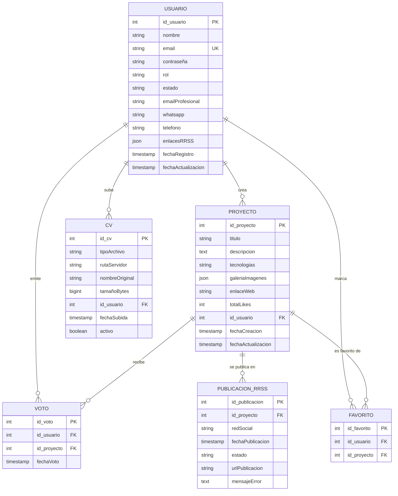
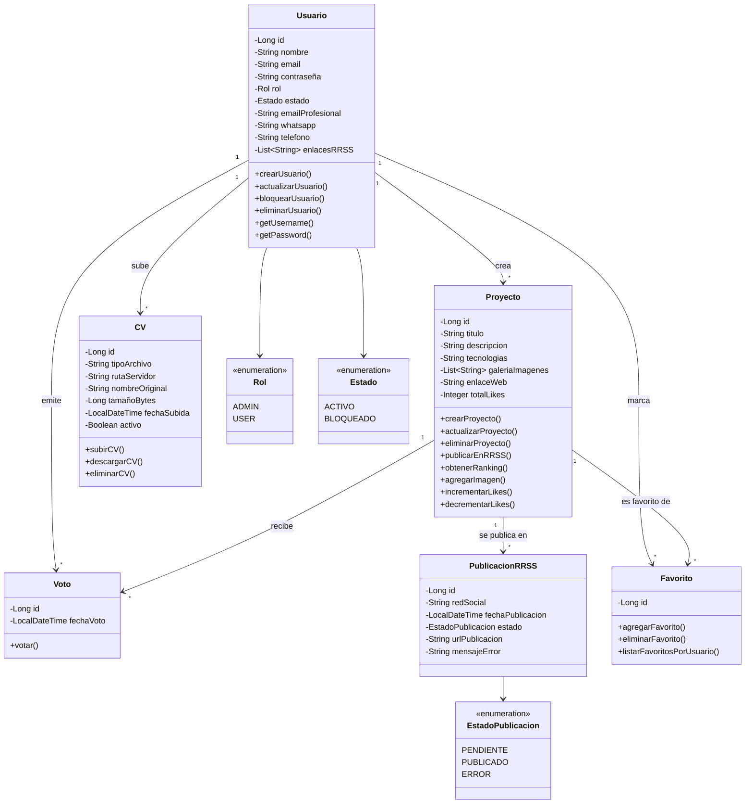

# Diagramas del Proyecto - Portfolio Social v2.0

## Modelo Entidad-Relación (ER)



---

## Diagrama de Clases UML



---

## Cómo usar estos diagramas

### En GitHub (README.md o documentación)
GitHub soporta Mermaid nativamente. Solo copia el bloque de código directamente en tu archivo Markdown.

### En herramientas online
1. **Mermaid Live Editor**: https://mermaid.live/
2. **Draw.io** con plugin Mermaid
3. **Confluence** (si tienes la extensión)

### Exportar como imagen
1. Ve a https://mermaid.live/
2. Pega el código Mermaid
3. Haz clic en "Actions" → "PNG" o "SVG"
4. Descarga la imagen

---

## Notas técnicas

### Constraint UNIQUE en Voto
```sql
UNIQUE (id_usuario, id_proyecto)
```
Un usuario solo puede votar una vez por proyecto.

### Constraint UNIQUE en Favorito
```sql
UNIQUE (id_usuario, id_proyecto)
```
Un usuario solo puede marcar el mismo proyecto como favorito una vez.

### Cascada en eliminaciones
- Al eliminar Usuario → se eliminan sus Proyectos, CVs, Votos y Favoritos
- Al eliminar Proyecto → se eliminan sus Votos, PublicacionRRSS y Favoritos

